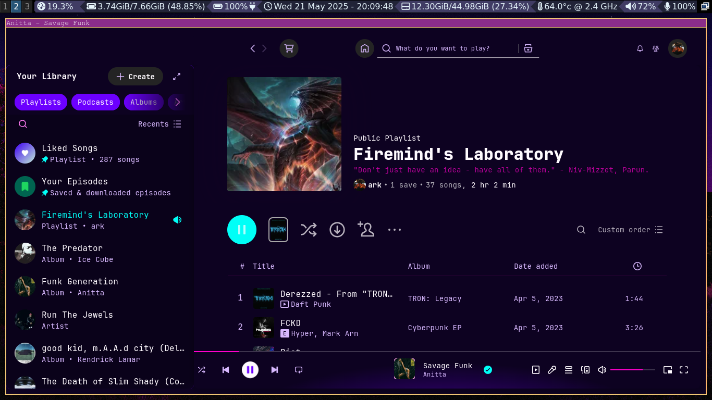

# ArchConfigFiles

## Spicetify Theme: Synthwave Custom

This setup includes:

- `user.css`: Full Dribbblish override with synthwave blur, transparency, and font overrides (e.g. JetBrains Mono).
- `color.ini`: Includes `[synthwave]` section with neon purples, pinks, and cyan highlights.
- `spicetify_config.ini`: Main config file for your Spicetify installation.

### Apply with:
```bash
spicetify config current_theme Dribbblish
spicetify config color_scheme synthwave
spicetify apply
```

---

### Preview

Here's how it looks:


